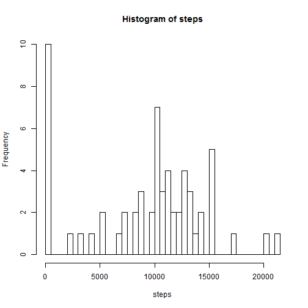
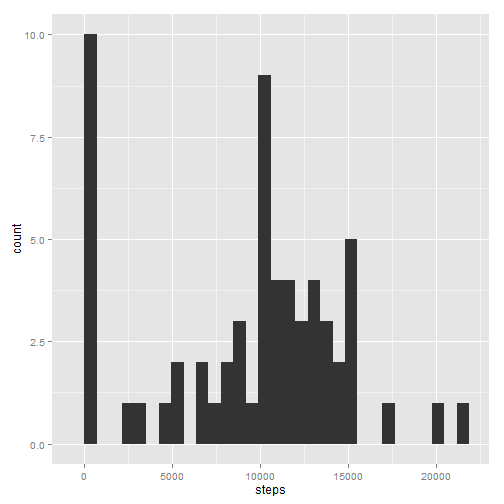
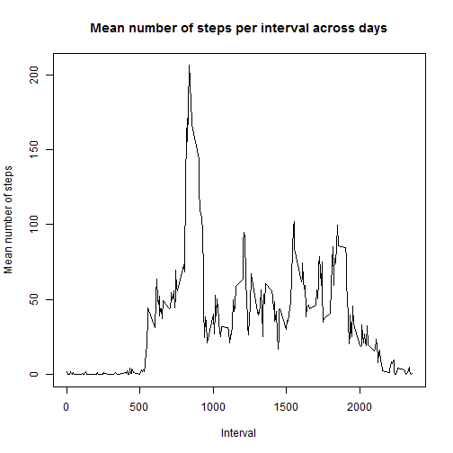
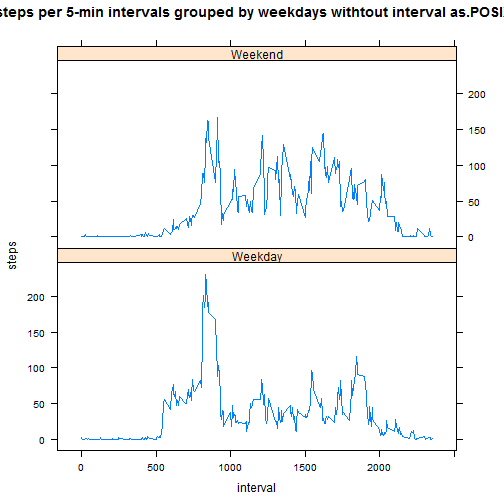
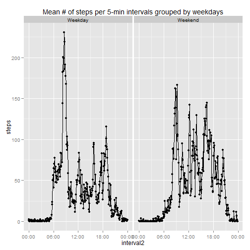
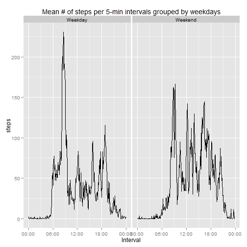

# Reproducible Research: Peer Assessment 1
2014/07/20 - By: MonicaPH

## Loading and preprocessing the data

The data file is unzipped, the csv is read and the data type of the second column is set to Date.


```r
library(plyr)
library(lattice)
library(ggplot2)
library(scales)

Sys.setlocale("LC_TIME", "English")       # Set language to engish
```

```
## [1] "English_United States.1252"
```

```r
unzip("activity.zip",exdir=".")
data <- read.csv("activity.csv")
data[,2]<-as.Date(data[,2],format="%Y-%m-%d")
```

## What is mean total number of steps taken per day?

First, calculating and plotting the sum of steps per day, including those with missing values (not part of the assignment, but kept as a personal note). Furtermore, a plot (using the base system) of the histogram with the number of steps and their frequency of repetition:


```r
stepXday <- ddply(data,.(date),numcolwise(sum, na.rm = TRUE))[,1:2]
hist(stepXday$steps,breaks=61,main="Histogram of steps", xlab="steps")
```

 

The same plot using the ggplot2 system:


```r
ggplot(stepXday, aes(x=steps)) + geom_histogram()
```

```
## stat_bin: binwidth defaulted to range/30. Use 'binwidth = x' to adjust this.
```

 

Another manner of doing the same (assignment answer), but now without the days with zero steps, and plotting with the ggplot2 system:


```r
stepXday_withoutNA <-aggregate(steps ~ date, data, sum)
ggplot(stepXday_withoutNA, aes(x=steps)) + geom_histogram()
```

```
## stat_bin: binwidth defaulted to range/30. Use 'binwidth = x' to adjust this.
```

 

The mean and median total number of steps taken per day (without including the days with 0 steps) is calculated as follows:


```r
meanSteps <- mean(stepXday_withoutNA$steps)
meanSteps
```

```
## [1] 10766
```

```r
medianSteps <- median(stepXday_withoutNA$steps)
medianSteps
```

```
## [1] 10765
```


## What is the average daily activity pattern?

1. Time series plot of the 5-minute interval (x-axis) and the average number of steps taken, averaged across all days (y-axis):


```r
avStepsXinterval <- aggregate(.~interval, FUN=mean, data=data)
plot(avStepsXinterval$interval,avStepsXinterval$steps,type='l',main="Mean number of steps per interval across days", xlab="Interval", ylab="Mean number of steps")
```

 

2. Which 5-minute interval, on average across all the days in the dataset, contains the maximum number of steps?


```r
maxAVsteps <- max(avStepsXinterval[,2])
maxInt <- avStepsXinterval[avStepsXinterval[,2]==maxAVsteps,1:2]
maxInt
```

```
##     interval steps
## 104      835 206.2
```
As we can see, the interval with the maximum average number of steps is interval 

```
## NULL
```

## Imputing missing values

1.Finding and summing, the total number of missing values in the dataset (i.e. the total number of rows with NAs) is:


```r
isNAindex <- is.na(data[,1])
totalNA <- sum(isNAindex)
totalNA
```

```
## [1] 2304
```


2-3. These missing values can be filled in by including the mean number of steps for that 5-minute interval.The new dataset without missign values is stored in data2.


```r
data2 <- data
for(i in seq_along(data[,1])){
      if(isNAindex[i]==TRUE){
            data2[i,1] <- avStepsXinterval[avStepsXinterval[,1]==data[i,3],2]
      }
}
```

4. The histogram of the total number of steps taken each day is: 


```r
stepXday2 <-aggregate(steps ~ date, data2, sum)
ggplot(stepXday2, aes(x=steps)) + geom_histogram()
```

```
## stat_bin: binwidth defaulted to range/30. Use 'binwidth = x' to adjust this.
```

 

The mean and median total number of steps taken per day in the data with the missig values filled in are:


```r
meanSteps2 <- mean(stepXday2$steps)
meanSteps2
```

```
## [1] 10766
```

```r
medianSteps2 <- median(stepXday2$steps)
medianSteps2
```

```
## [1] 10766
```

Since I used mean values to replace missing values, the mean and the median did not change with respect to the dataset with the missing values. However, the distribution of the steps changed. the type of change can be very different according to the technique used to fill the gaps, and affect the results of further analysis. Therefore, it is very important to document it.


## Are there differences in activity patterns between weekdays and weekends?

1. To answer this question, first it is necessary to create a factor indicating whether the date was a weekday or not:


```r
weekDay <- weekdays(data2[,2],abbreviate = TRUE)
weekDay[weekDay %in% c("Mon","Tue","Wed","Thu","Fri")] <- "Weekday"
weekDay[weekDay %in% c("Sat","Sun")] <- "Weekend"
weekDay <- as.factor(weekDay)
data2[,4] <- weekDay
names(data2)[4] <- "weekDay"
```

2. To make a panel plot containing a time series plot (i.e. type = "l") of the 5-minute interval (x-axis) and the average number of steps taken, averaged across all weekday days or weekend days (y-axis), first it is necessary to prepare the data:


```r
avStepsXintervalWD <- aggregate(.~interval, FUN=mean, data=data2[data2[,4]%in%"Weekday",])
avStepsXintervalWD[,4] <- "Weekday"
avStepsXintervalWE <- aggregate(.~interval, FUN=mean, data=data2[data2[,4]%in%"Weekend",])
avStepsXintervalWE[,4] <- "Weekend"
data3 <- rbind(avStepsXintervalWD,avStepsXintervalWE)

data3$interval2 <- sprintf("%04d", data3$interval)
data3$interval2 <- strptime(data3$interval2,format="%H%M")

data3$weekDay <- as.factor(data3$weekDay)
```

Different methods to plot the data are possible. The best one it is the third one, because it gives the correct answer required by the assignment. The rest are here as a personal note.


```r
# Lattice plot withtout the interval transformed to as.POSIXct.POSIXlt
xyplot(steps~interval|weekDay, data=data3, layout=c(1,2),type='l', main="Mean # of steps per 5-min intervals grouped by weekdays withtout interval as.POSIXct.POSIXlt")
```

 

```r
# using qplot example
g <- qplot(interval2, steps, data = data3, facets = . ~ weekDay)
g + scale_x_datetime( labels = date_format("%H:%M")) + geom_line() + ggtitle("Mean # of steps per 5-min intervals grouped by weekdays")
```

 

```r
# To plot as the requirements of the assignment
g2 <- ggplot(data3, aes(x=interval2,y=steps)) 
g2 + geom_line() + facet_grid(. ~ weekDay) + scale_x_datetime( labels = date_format("%H:%M")) + ggtitle("Mean # of steps per 5-min intervals grouped by weekdays") + xlab("Interval")
```

 


